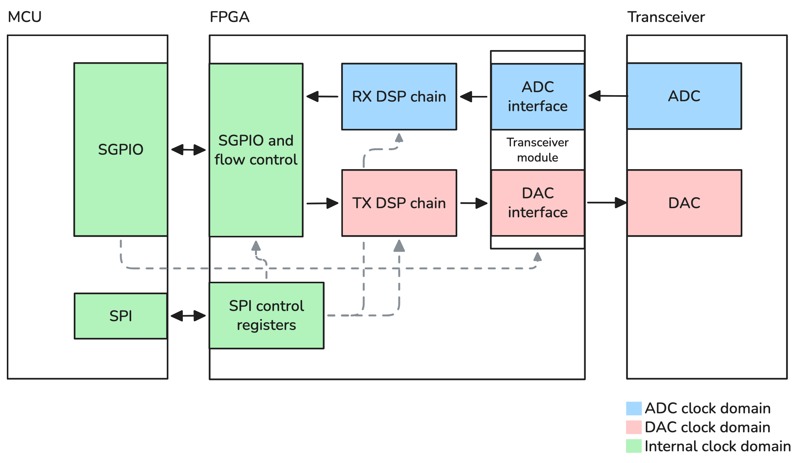
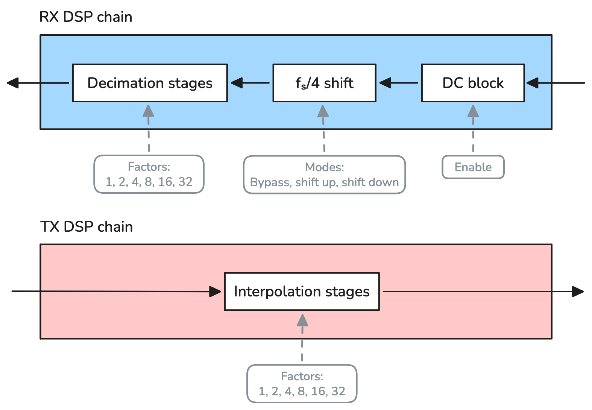
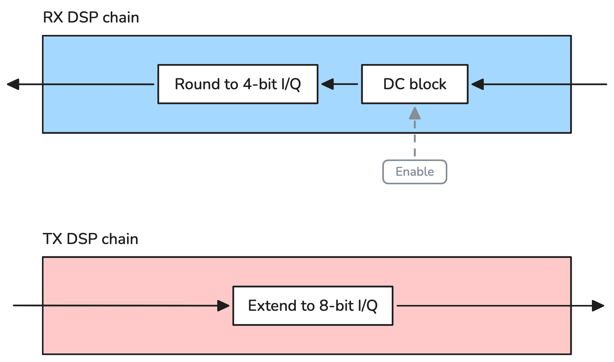
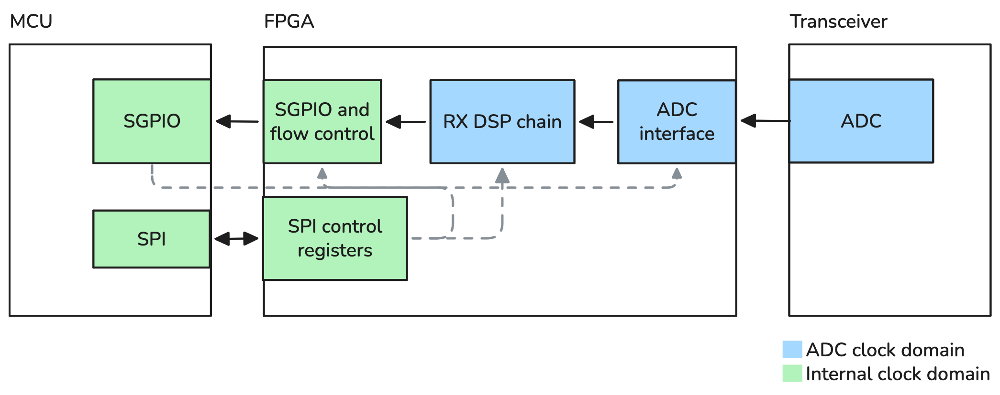
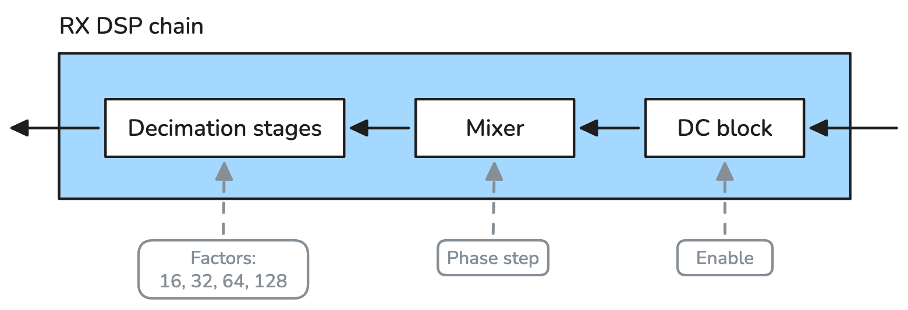
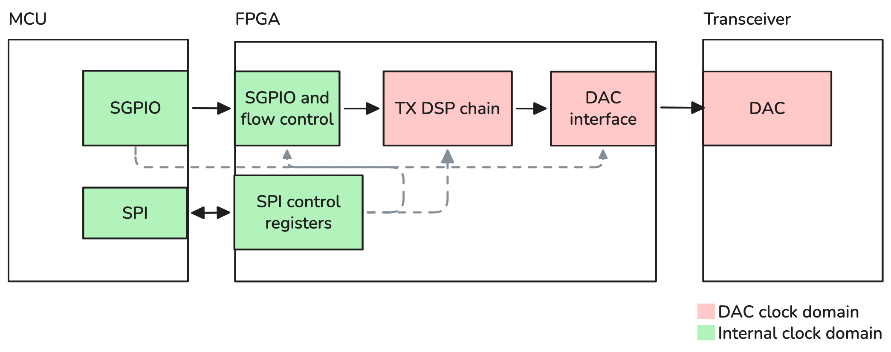
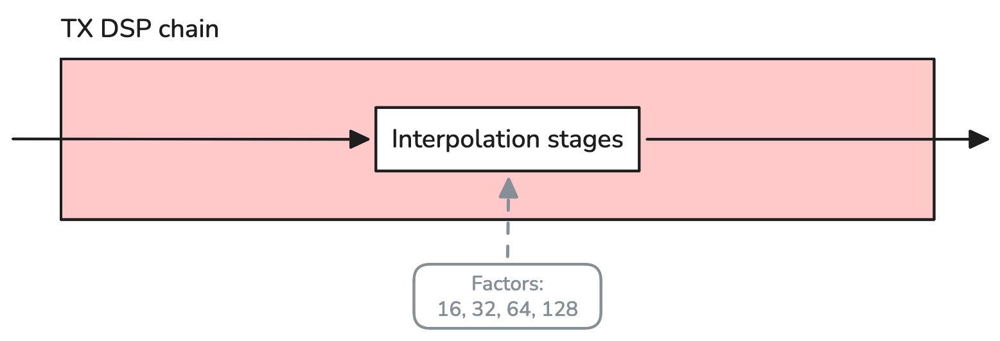

================================================
Gateware
================================================

One of the significant hardware changes in :ref:`HackRF Pro <hackrf_pro>` is the replacement of the CPLD with a FPGA. While the older CPLD primarily provided glue logic between the MCU and RF front end, the FPGA in HackRF Pro introduces more logic and DSP capability. This enables offloading digital signal processing tasks from the MCU.

FPGAs are highly flexible devices whose behavior is defined by *gateware*: hardware descriptions that configure the internal logic fabric. HackRF Pro gateware is written in `Amaranth HDL <https://amaranth-lang.org/>`__, a Python-based hardware description language.

The specific FPGA device used in HackRF Pro is the Lattice iCE40UP5K, which features 
5280 LUT4s and 8 dedicated DSP (multiply-accumulate) blocks. We rely on the `open-source iCE40 FPGA toolchain <https://github.com/YosysHQ/icestorm>`__ to build the required bitstreams that are bundled in the firmware.

All gateware source code lives under `firmware/fpga/` in the HackRF repository. Top-level designs reside in `firmware/fpga/top/` and are the primary entry points for different operational modes.

By default, a standard gateware configuration is loaded at boot. However, the firmware can dynamically reconfigure the FPGA at runtime to switch between different gateware variants.

Standard gateware
~~~~~~~~~~~~~~~~~

The standard gateware is used by default when the firmware has not requested an alternative bitstream.

The standard gateware provides a balanced configuration optimized for general-purpose operation. It implements configurable digital signal processing paths for the reception and transmission paths, capable of (limited) frequency translation and supporting a wide range of sample rates.

Block diagram
^^^^^^^^^^^^^

Features
^^^^^^^^
* 8-bit I, 8-bit Q data format
* Receiver signal chain:
    * Optional DC offset removal (DC blocker)
    * Configurable fs/4 shifter (quarter sample rate): bypass, shift up or shift down
    * Configurable decimation rates: 1x, 2x, 4x, 8x, 16x, 32x
* Transmitter signal chain:
    * Configurable interpolation rates: 1x, 2x, 4x, 8x, 16x, 32x
* SPI control interface for register configuration
* Double data rate (DDR) interface to RF transceiver
* Interface to MCU (SGPIO)

Half-precision gateware
~~~~~~~~~~~~~~~~~~~~~~~

The half-precision gateware reduces sample width to 4 bits per I/Q component, enabling higher throughput within the constraints of the USB interface (up to 40 Msps).

This configuration is intended for applications where bandwidth is more critical than dynamic range, such as wideband spectrum monitoring.

Block diagram
^^^^^^^^^^^^^

Features
^^^^^^^^
* 4-bit I, 4-bit Q data format
* Receiver signal chain:
    * Optional DC offset removal (DC blocker)
    * Round to 4-bit I/Q
* Transmitter signal chain:
    * Extend width to 8-bit I/Q
* SPI control interface for register configuration
* Double data rate (DDR) interface to RF transceiver
* Interface to MCU (SGPIO)

Extended-precision gateware (RX and TX)
~~~~~~~~~~~~~~~~~~~~~~~~~~~~~~~~~~~~~~~

The extended-precision gateware increases internal signal processing precision and output sample width to improve signal quality. The main drawback is that the minimum decimation or interpolation factor is 16x. Due to increased logic requirements, this gateware is split in two top-level designs (RX and TX).

Samples are 16-bit I/Q, while the effective number of bits (ENOB) depends on the selected configuration and typically ranges between 9 and 11 bits.

The increased dynamic range of the output makes it particularly useful for weak and/or narrowband signals.

Block diagram (RX)
^^^^^^^^^^^^^^^^^^

Block diagram (TX)
^^^^^^^^^^^^^^^^^^

Features
^^^^^^^^
* 16-bit I, 16-bit Q data format
* Receiver signal chain (RX extended-precision gateware):
    * Optional DC offset removal (DC blocker)
    * Configurable mixer (in fs/128 steps)
    * Configurable decimation rates: 16x, 32x, 64x, 128x
* Transmitter signal chain (TX extended-precision gateware):
    * Configurable interpolation rates: 16x, 32x, 64x, 128x
* SPI control interface for register configuration
* Double data rate (DDR) interface to RF transceiver
* Interface to MCU (SGPIO)

