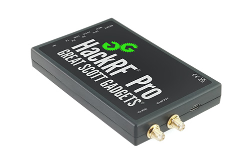

================================================
HackRF Pro
================================================

HackRF Pro is the current hardware platform for the HackRF project. It is a Software Defined Radio peripheral capable of transmission or reception of radio signals from 100 kHz to 6 GHz. HackRF Pro is designed to be backwards compatible with software and hardware developed for use with
:ref:`HackRF One <hackrf_one>`,
whilst introducing many new features and improvements.

| `Product page <https://greatscottgadgets.com/hackrf/pro/>`_
| `Where to buy <https://greatscottgadgets.com/hackrf/pro/#purchasing>`_

Features
~~~~~~~~

    * 100 kHz to 6 GHz operating frequency
    * Tunable from 0 Hz to 7.1 GHz
    * Half-duplex transceiver
    * Up to 20 million samples per second
    * 8-bit quadrature samples (8-bit I and 8-bit Q)
    * Compatible with GNU Radio, SDR#, and more
    * Software-configurable RX and TX gain and baseband filter
    * Software-controlled RF port power (50 mA at 3.3 V)
    * SMA RF connector
    * SMA clock input and output for synchronization and triggering
    * Convenient buttons for programming
    * Internal pin headers for expansion
    * High-Speed USB 2.0 with Type-C connector
    * USB-powered
    * Open source hardware

Compared to HackRF One, HackRF Pro introduces a host of new and updated features, including:

    * Wider operating frequency range
    * Improved RF performance with flatter frequency response
    * Modern USB Type-C connector
    * Built-in TCXO crystal oscillator for superior timing stability
    * Logic upgrade from a CPLD to a power-efficient FPGA
    * Elimination of the DC spike
    * Extended-precision mode with 16-bit samples for low sample rates (typical ENOB: 9-11)
    * Half-precision mode with 4-bit samples at up to 40 Msps
    * More RAM and flash memory for custom firmware
    * Installed shielding around the radio section
    * Trigger input and output accessible through clock connectors
    * Cutout in the PCB provides space for future add-ons
    * Improved power management
    * Enhanced RF port protection
    * Facility to hardware-disable transmit mode
