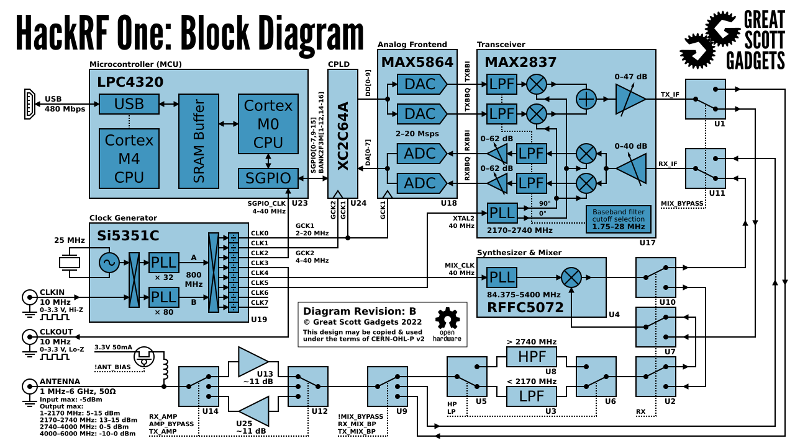
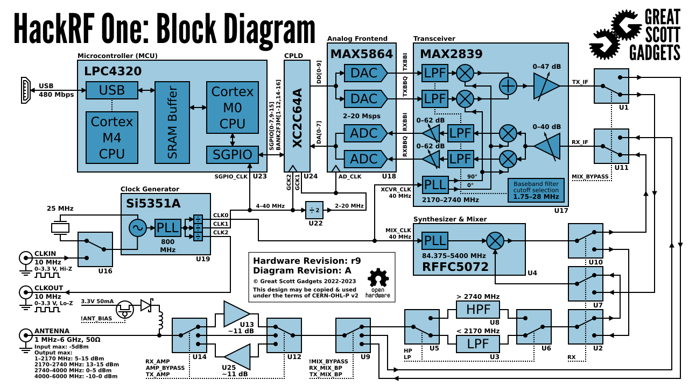

================================================
Hardware Components
================================================

Major parts used in HackRF One:

* `MAX2837 2.3 to 2.7 GHz transceiver <https://www.analog.com/en/products/max2837.html>`__
    * `Datasheet <https://www.analog.com/media/en/technical-documentation/data-sheets/max2837.pdf>`__
* `MAX2839 2.3 to 2.7 GHz transceiver <https://www.analog.com/en/products/max2839.html>`__
    * `Datasheet <https://www.analog.com/media/en/technical-documentation/data-sheets/max2839.pdf>`__
    * substitution for MAX2837.
* `MAX5864 ADC/DAC <https://www.analog.com/en/products/max5864.html>`__
    * `Datasheet <https://www.analog.com/media/en/technical-documentation/data-sheets/MAX5864.pdf>`__
* `Si5351 clock generator <http://www.silabs.com/products/clocksoscillators/clock-generator/Pages/lvcmos-clocks-5-outputs.aspx>`__
    * `AN619: Manually Generating an Si5351 Register Map <http://www.silabs.com/Support%20Documents/TechnicalDocs/AN619.pdf>`__
    * `Datasheet <http://www.silabs.com/Support%20Documents/TechnicalDocs/Si5351.pdf>`__ - see AN619 for the complete register map.
    * `Other Documentation <http://www.silabs.com/products/clocksoscillators/clock-generators-and-buffers/Pages/clock+vcxo.aspx>`__ - includes application notes, user guides, and white papers.
* CoolRunner-II CPLD
* `LPC43xx ARM Cortex-M4 microcontroller <http://www.nxp.com/products/microcontrollers-and-processors/arm-processors/lpc-arm-cortex-m-mcus/lpc-dual-core-cortex-m0-m4f/lpc4300:MC_1403790133078>`__
    * `User Manual <http://www.nxp.com/documents/user_manual/UM10503.pdf>`__
    * `Datasheet <http://www.nxp.com/documents/data_sheet/LPC4350_30_20_10.pdf>`__
    * `Other Documentation (LPC4330FBD144) <http://www.nxp.com/products/microcontrollers/cortex_m4/lpc4300/LPC4330FBD144.html#documentation>`__ - includes errata and application notes.
    * `ARM-standard JTAG/SWD connector pinout <http://www.keil.com/support/man/docs/ulink2/ulink2_hw_connectors.htm>`__
    * `BSDL file for the LPC43xx (For boundary scan) <http://www.lpcware.com/system/files/LPC18xx_43xx%20BSDL%20files%2020121127_0.zip>`__
* `RFFC5072 mixer/synthesizer <http://www.rfmd.com/store/rffc5072-1.html>`__
    * `Datasheet <http://www.rfmd.com/CS/Documents/RFFC5071_2DS.pdf>`__
    * `Other Documentation <http://www.rfmd.com/store/rffc5072-1.html>`__ ; click "Technical Documents" - includes programming guides and application notes.
* `W25Q80BV 8M-bit Flash <https://www.winbond.com/resource-files/w25q80bv%20revk%2020151203.pdf>`__

Block Diagrams
~~~~~~~~~~~~~~

|

