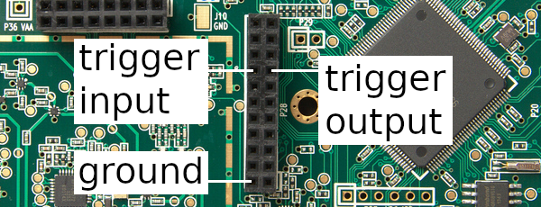

.. _hardware_triggering:

===================
Hardware Triggering
===================

HackRF One transmit and receive operations can be synchronized with another HackRF One or with other external equipment by using the trigger input and output on pin header P28. Triggering provides time synchronization with error of less than one sample period.

Clock Synchronization
~~~~~~~~~~~~~~~~~~~~~

When triggering one HackRF One from another, it is often desirable to first ensure that the two devices share a common frequency reference. This has an added benefit of grounding the HackRFs to each other, eliminating one of the wires required for triggering. See :ref:`External Clock Interface <external_clock_interface>` for instructions.

Either HackRF One may serve as the clock source for the other regardless of which is providing the trigger output.

Requirements
~~~~~~~~~~~~

To connect two HackRF Ones for triggering you will need:

    * a male-to-male jumper wire for 0.1" pin headers
    * an SMA cable for clock synchronization or a second jumper wire

.. _open_your_hackrf_one:

Open Your HackRF One
~~~~~~~~~~~~~~~~~~~~

If your HackRF Ones are not bare boards, you will need to open up their cases to access the pin headers on the HackRF Ones. Each HackRF One case has small plastic clips holding it together. These clips may be damaged when the case is opened, but typically the case can still be used after such damage. Please follow the instructions in `this video <https://www.youtube.com/watch?v=zuXJtpTSEJM>`__ by `Jared Boone <https://twitter.com/sharebrained>`__ to open your HackRF One cases.

Identify the Trigger Pins
~~~~~~~~~~~~~~~~~~~~~~~~~

HackRF One has four normally-populated pin headers, three of which are arranged in a 'C' shape. On the circuit board these are marked P28, P22, and P20. P28 is the header nearest to the center of the board. Locate pins 15 (trigger output) and 16 (trigger input) on header P28.

Connect the Trigger Output to the Trigger Input
~~~~~~~~~~~~~~~~~~~~~~~~~~~~~~~~~~~~~~~~~~~~~~~

First ensure that the two devices share a common ground. This may be accomplished by connecting one's CLKIN to the other's CLKOUT as recommended above. Alternatively, connect a jumper wire from P28 pin 2 on one HackRF One to P28 pin 2 on the other HackRF One.

Next use a jumper wire to connect P28 pin 15 (trigger output) on one HackRF One to P28 pin 16 (trigger input) on the other HackRF One.

Usage
~~~~~

Use ``hackrf_info`` to discover the serial numbers of both HackRF Ones. Using the serial number of the HackRF One to be triggered, use ``hackrf_transfer -H`` to set up a triggered operation. For example:

* ``hackrf_transfer -H -d <serial number> -a 0 -l 32 -g 32 -r rx1.cs8``

The command will print "Waiting for trigger..." until a trigger signal is detected on the device's trigger input.

In another terminal, use the serial number of the triggering HackRF One to initiate an operation to take place at the same time as the triggered operation. For example:

* ``hackrf_transfer -d <serial number> -a 0 -l 32 -g 32 -r rx2.cs8``

Note that no special argument is required to activate the trigger output.

Both ``hackrf_transfer`` commands will start sampling RF signals at the same time, accurate to less than one sample period.

Additional Devices
~~~~~~~~~~~~~~~~~~

Multiple HackRF Ones may be triggered by a single HackRF One. Ensure that all the devices share a common ground and then connect one device's trigger output to the trigger inputs of the other devices (with jumpers connected via a breadboard, for example).

Equipment other than a HackRF One may be connected to a HackRF One's trigger input or output. The trigger signal is a 3.3 V pulse that triggers on the rising edge.

References
~~~~~~~~~~

HackRF's trigger mechanism was contributed by the authors of `Synchronisation of Low-Cost Open Source SDRs for Navigation Applications <http://spcomnav.uab.es/docs/conferences/Bartolucci_NAVITEC_2016.pdf>`__ which provides details about the implementation and background.
