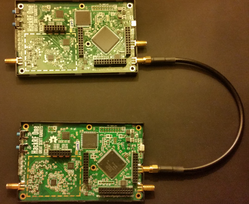
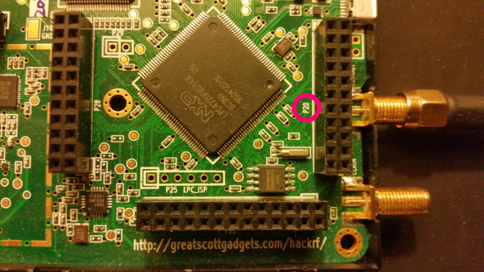
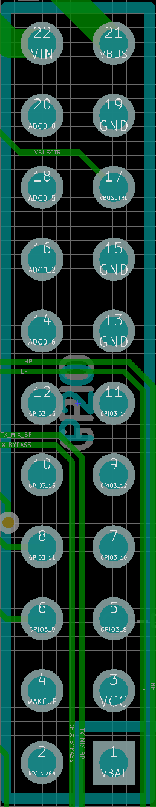
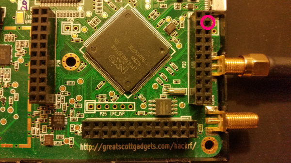
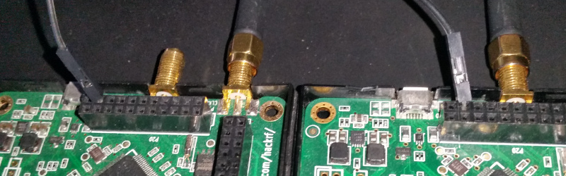
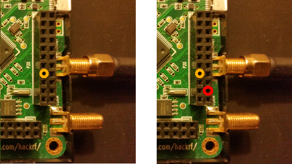
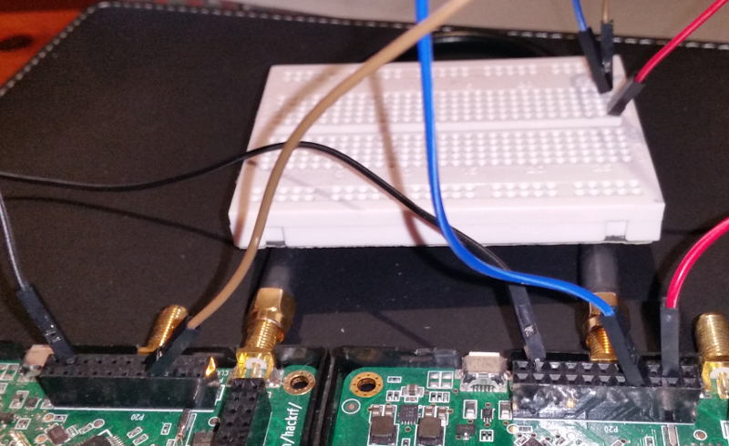
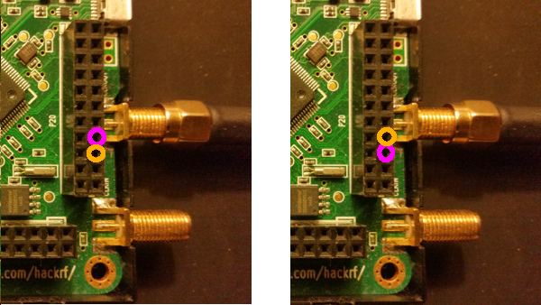
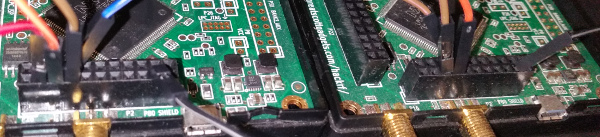
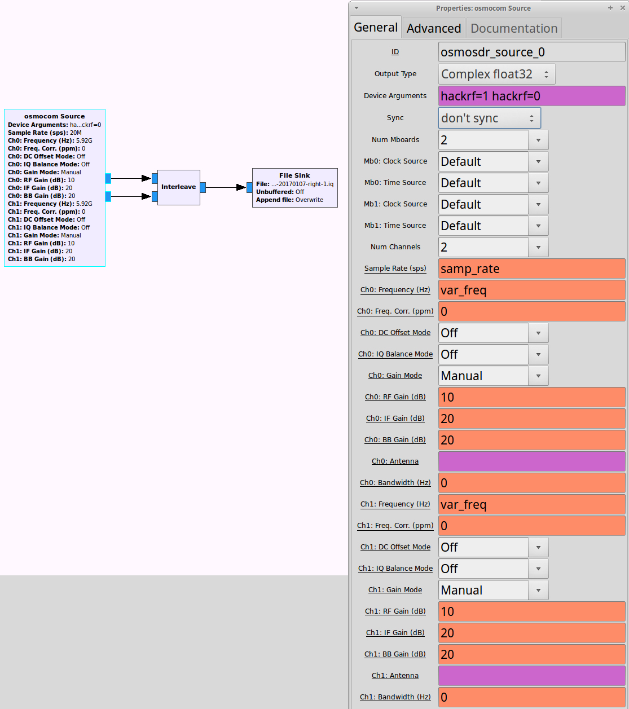

================================================
Multiple Device Hardware Level Synchronization
================================================

Purpose
~~~~~~~

This page describes the modifications required to get multiple HackRF hardware-level synchronisation working. Synchronisation is required for many applications where a single HackRF isn't sufficient:

    * phase correlation
    * oversampling using multiple devices
    * 40MHz (or more) protocols such as WiFi

The HackRFs will start transmitting USB packets at the same time, which results in an inter-device offset of ~50 samples at a sample rate of 20MSps. Without this synchronisation, the offset is in the range of thousands to tens of thousands of samples. This is due to the USB start command being called sequentially for each device, along with USB buffering, OS-level timing etc.

**BE WARNED** you will have to open your HackRFs, which is most likely going to destroy the plastic case it comes in. You will also be electrically connecting them together. If you do this incorrectly, there is a good chance one or all of the devices will be permanently destroyed.

Related work
~~~~~~~~~~~~

\"bardi\_\" on the #hackrf channel pointed out his paper on synchronising HackRFs. This uses the HackRF CPLD to synchronise multiple devices.

Requirements
~~~~~~~~~~~~

For this to work you will need:

    * at least two devices
    * a clock sync cable
    * some connecting cables (pin header-type)
    * a breadboard

.. _opening_your_hackrf:

Opening your HackRF
~~~~~~~~~~~~~~~~~~~

The HackRF case has small plastic clips holding it together. These are usually destroyed when the case is opened. Please follow the instructions in `this video <https://www.youtube.com/watch?v=zuXJtpTSEJM>`__ by `Jared Boone <https://twitter.com/sharebrained>`__.

Connect the clocks
~~~~~~~~~~~~~~~~~~

Connecting the HackRF clocks together will force them to sample at precisely the same rate. The individual samples will most likely be sampled at slightly different times due to phase offsets in the clock ICs, but for most purposes this is acceptable.

Choose a **primary** HackRF, and connect the clock sync cable from the clock out connector to the clock in connector of the **second** HackRF. If you're using another HackRF, connect the second HackRF's clock out to the **third** HackRF's clock in.

Your HackRFs should look like this: 

Identify the pin headers
~~~~~~~~~~~~~~~~~~~~~~~~

Firstly, this has only been tested on official HackRF Ones. If you have a jawbreaker, HackRF blue or another HackRF-inspired device, you will have to figure out how to connect the devices correctly, using the schematics.

The hackrf has four pin headers, three of which are arranged in a 'C' shape. On the board these are marked as *P28*, *P22* and *P20*. *P20* is the header closest to the *clock in/clock out* connectors. For this exercise we will only be discussing *P20*. The `hackrf schematics <https://github.com/mossmann/hackrf/tree/master/hardware/hackrf-one>`__ are a very good reference for this activity. The relevant part can been seen in the following image:

This is the P20 schematic diagram: 

Wire up the pin headers
~~~~~~~~~~~~~~~~~~~~~~~

As mentioned before **BE WARNED**, this step could easily result in **one or all** of your HackRFs being **permanently damaged**.

Now that's out of the way, let me describe what we're doing here. The first part of this exercise is to give both devices a common ground. This is really important for any inter-device electrical connections, as it prevents ICs from seeing slight differences in the respective GND levels as legitimate signals. As shown on the schematic, many of the pins in P20 are GND pins. We use P20-PIN19 on both devices and connect them together like so: 

We then need a *positive* (+5v) connection to 'fake' the *third* hackrf if it's not present. We use *P20-PIN3* from the **primary** hackrf for this, and bring it down to the breadboard. *primary:P20-PIN8* and *secondary:P20-PIN8* are ready input GPIO pins for the missing third HackRF. Connect these to the breadboard *positive* line. After this your setup should look like so: 

Next we connect the *primary:P20-PIN7 ready* GPIO pin input to the *secondary:P20-PIN5 ready* GPIO pin output, and the *primary:P20-PIN5 ack* GPIO pin output to the *secondary:P20-PIN7* ack GPIO pin input. This is the final step, and should look as follows:

Upgrade
~~~~~~~

Now that the hardware is setup, you need to upgrade your HackRFs' firmware, and your *libhackrf* to at least `v2017.02.1 <https://github.com/mossmann/hackrf/releases/tag/v2017.02.1>`__ as per :ref:`this documentation page <updating_firmware>`.

Testing with hackrf_transfer
~~~~~~~~~~~~~~~~~~~~~~~~~~~~

The latest version of *hackrf_transfer* includes the '-H' flag, which will activate hardware synchronisation (via libhackrf via the firmware). Testing this way is a little tricky because neither HackRF will start sending data until they are synched, and *hackrf_transfer* will time out if it hasn't received any data within one second. So the test requires that **two** copies of _hackrf_transfer are started within 1 second of each other. My approach is to have two terminal windows with the relevant commands waiting, and quickly run them.

This test will fail if:

    * your hackrf firmware or libhackrf are out of date
    * your connectors are incorrectly set up
    * your timing is too slow when running hackrf_transfer

Run the following command:

    * hackrf_transfer -d <device A> -r <filename-A> -H &; hackrf_transfer -d <device B> -r <filename-B> -H

If the test runs correctly, you have successfully streamed synchronised data from two HackRFs!

The two streams can be merged into one using GnuRadio, and then viewed using `this hacky piece of PyQt <https://github.com/dodgymike/direction-finding/blob/master/decode_remote_dual_stream.py>`__.

What next?
~~~~~~~~~~

Obviously the method of wiring up multiple HackRFs described above is fragile and prone to error. Perhaps a PCB could be designed that will connect up to four HackRFs together by plugging into the 'C-shape' pin headers.

Usually the *Osmocom source* can be used for multi-device streaming, as it can be configured to pull from more than one device. Unfortunately the current version does not have hardware synchronisation built in. Work is being done to make the *Osmocom source* compatible with these changes.

