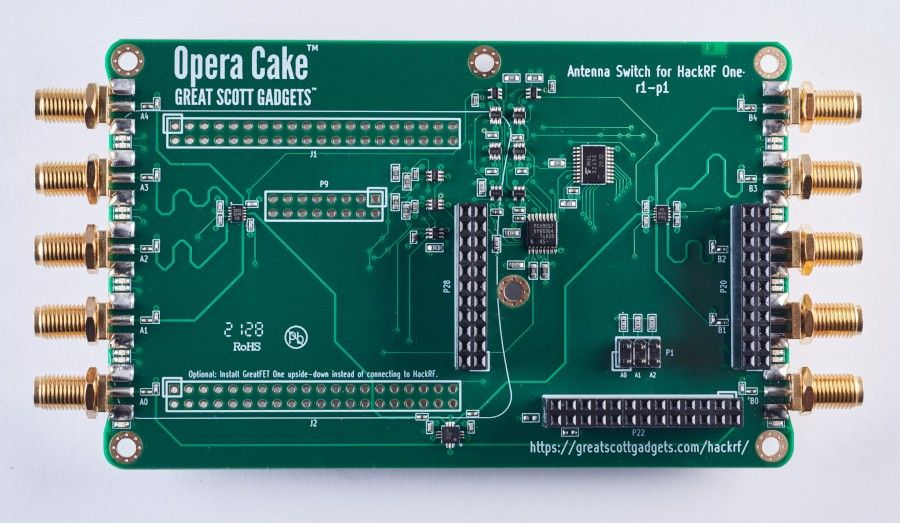

==========
Opera Cake
==========

Opera Cake is an antenna switching add-on board for HackRF One. Consisting of two 1x4 switches, Opera Cake also has a cross-over switch that permits operation as a 1x8 switch. Up to eight Opera Cakes may be stacked onto a single HackRF One provided that each Opera Cake is configured with a different board address.

Opera Cake can be used as a 1x8 switch to connect your HackRF One to a variety of antennas at once, such as a long wire antenna for HF bands, a discone for VHF and UHF, a dipole for 2.4 GHz, and a dish for a satellite band. Once connected to your Opera Cake you can switch between all of your antennas in software instead of making physical hardware swaps.

When set up as a pair of 1x4 switches you could use Opera Cake as a switched filter bank. To do this, connect port A1 to B1, A2 to B2, A3 to B3, and A4 to B4 through physical SMA filters and cables of your choosing. This setup allows you to change your transmit or receive to be through the filter of your choosing without having to reconnect hardware every time you would like to use a different filter.

Opera Cake is configured with the ``hackrf_operacake`` command-line tool.
