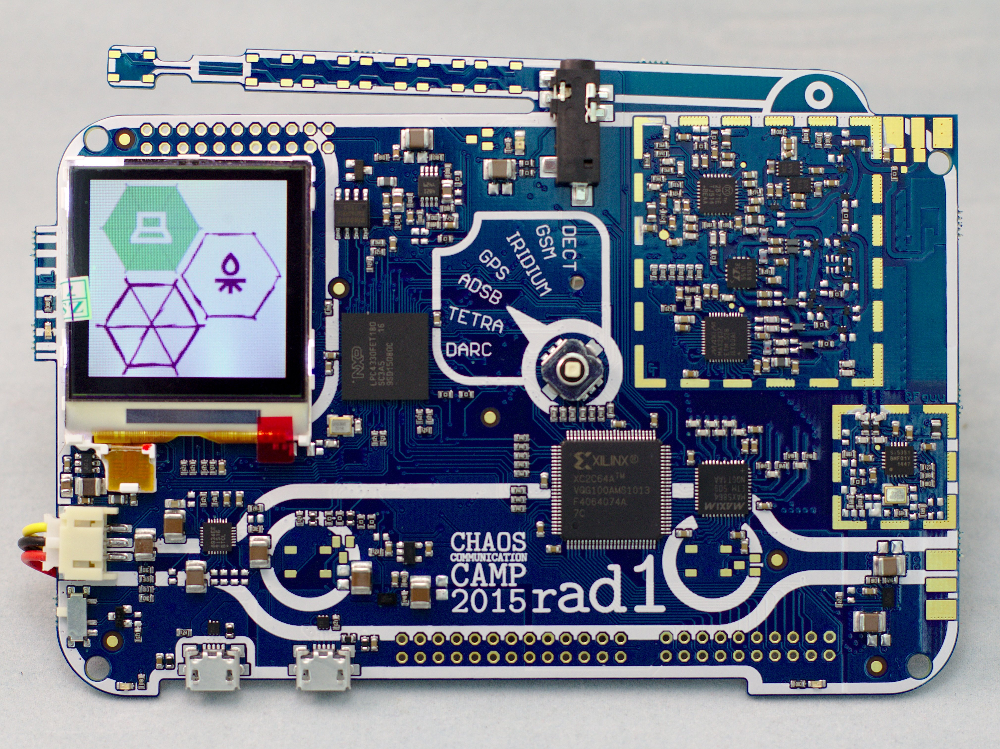

=====
rad1o
=====

rad1o is the badge from the 2015 Chaos Communication Camp.

The rad1o badge contains a full-featured SDR (software defined radio) half-duplex transceiver, operating in a frequency range of about 50 MHz - 4000 MHz, and is software compatible to the HackRF.

(rad1o picture provided by Christoph Krichenbauer with Creative Commons License CC-BY-NC_SA)

More information can be found at the `rad1o badge wiki <https://rad1o.badge.events.ccc.de/start>`__

Compared to HackRF One, the rad1o badge uses a different mixer (MAX2871) with a reduced frequency range.
