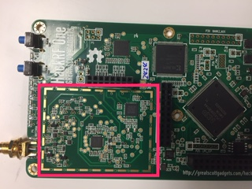
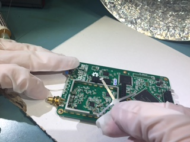
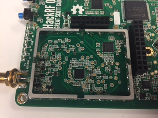
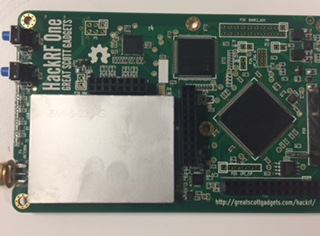

===============================================
RF Shield Installation Instructions
===============================================

Official Great Scott Gadgets HackRF Ones do not come from the factory with an RF shield installed around the radio section of the PCB. They do, however, have pads in place so that one may be installed if a user has a reason and an inclination to do so. The reason that they do not come preinstalled is that early testing revealed that the RF shield did little to improve the performance of the HackRF One. The recommended RF shield is the BMI-S-230-F-R (frame) with the BMI-S-230-C (shield). A two part RF shield is recommended because the shield section can be removed to allow access to the RF section of the HackRF One. This can be important if it becomes necessary to probe any part of the RF section, or to replace any parts of the RF section. However, even with a two part RF shield, it can be difficult to access the RF section of the HackRF One in certain situations. The following steps are a basic set of instructions for installing a RF shield on a HackRF One.

**CAUTION: Soldering a RF shield onto a HackRF One comes with a certain amount of risk. Beyond the inherent risks of soldering itself, this process may damage the HackRF One and no warranty is available to cover damage incurred from this process. If you do choose to install a RF shield on your HackRF One please proceed with caution.**

1. Remove the HackRF One from the injection molded plastic case. 

  **BE WARNED: Opening the plastic case of your HackRF One will most likely destroy the tabs that hold it together.**  

  Instructions for removing a HackRF One from it's case can be found :ref:`here <opening_your_hackrf>`.

2. Prepare the HackRF One PCB for soldering on the shield frame, by adding flux to the RF shield pads around the radio section on the PCB.

	
3. Place the RF shield frame on the HackRF One, aligning it so that it makes contact with all of the pads around the RF section of the board.

.. image:: ../images/rf_shield_2.jpg
	:align: center

	
4. Solder the shield to one pad to anchor it to the H1. Visually inspect the frame to assure that it is still aligned properly.

+---------------------------------------+---------------------------------------+
| .. image:: ../images/rf_shield_3.jpg  | .. image:: ../images/rf_shield_4.jpg  |
+---------------------------------------+---------------------------------------+

5. Connect the frame to another pad on the opposite side from the first connection. Again, check that the frame is still aligned properly.

+---------------------------------------+---------------------------------------+
| .. image:: ../images/rf_shield_5.jpg  | .. image:: ../images/rf_shield_6.jpg  |
+---------------------------------------+---------------------------------------+

6. Connect at least one more pad, and then remove the pick and place bridge from the frame. *Removing the pick and place bridge is optional, but it is recommended.*

7. Continue soldering the rest of the pads to the frame.

8. Clean the flux and soldering residue with the appropriate solvent for the type of flux used. Be sure to let the HackRF One dry completely before plugging it in to a power source.

9. Place the RF shield onto the frame and snap it into place.

10. If desired, put the HackRF One back into the plastic case, if it is still able to click together. 
