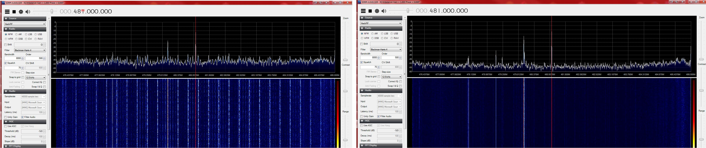
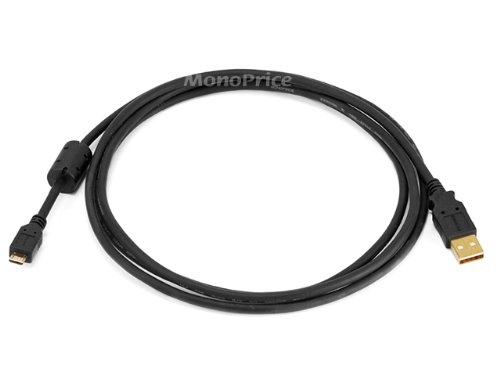

================================================
Tips and Tricks
================================================

USB Cables (and why to use a noise reducing one)
~~~~~~~~~~~~~~~~~~~~~~~~~~~~~~~~~~~~~~~~~~~~~~~~

The USB cable you choose can make a big difference in what you see when using your HackRF and especially when using it around between 120 and 480 MHz where USB is doing all its work.

    #. Use a shielded USB cable. The best way to guarantee RF interference from USB is to use an unshielded cable. You can test that your cable is shielded by using a continuity tester to verify that the shield on one connector has continuity to the shield on the connector at the other end of the cable.

    #. Use a short USB cable. Trying anything larger than a 6ft cable may yield poor results. The longer the cable, the more loss you can expect and when making this post a 15ft cable was tried and the result was the HackRF would only power up half way.

    #. For best results, select a cable with a ferrite core. These cables are usually advertised to be noise reducing and are recognizable from the plastic block towards one end.

Screenshot before and after changing to a noise reducing cable (`view full size image <http://i.imgur.com/e64LASK.jpg>`__): 

The `cable <http://www.amazon.com/gp/product/B00A99BR90/ref=oh_aui_detailpage_o02_s00?ie=UTF8&psc=1>`__ used when making the screenshot for the difference in noise is: 

The before and after images were both taken with the preamp on and the LNA and VGA both set to 24db.

Sampling Rate and Baseband Filters
~~~~~~~~~~~~~~~~~~~~~~~~~~~~~~~~~~

Using a sampling rate of less than 8MHz is not recommended. Partly, this is because the MAX5864 (ADC/DAC chip) isn't specified to operate at less than 8MHz, and therefore, no promises are made by Maxim about how it performs. But more importantly, the baseband filter in the MAX2837 has a minimum bandwidth of 1.75MHz. It can't provide enough filtering at 2MHz sampling rate to remove substantial signal energy in adjacent spectrum (more than +/-1MHz from the tuned frequency). The MAX2837 datasheet suggests that at +/-1MHz, the filter provides only 4dB attenuation, and at +/-2MHz (where a signal would alias right into the center of your 2MHz spectrum), it attenuates about 33dB. That's significant. Here's a picture:

.. image:: ../images/samplepicture1.png
	:align: center

At 8MHz sampling rate, and using the minimum 1.75MHz bandwidth filter, this is the response:

.. image:: ../images/samplepicture2.png
	:align: center

You can see that the attenuation is more than 60dB at +/-2.8MHz, which is more than sufficient to remove significant adjacent spectrum interference before the ADC digitizes the baseband. If using this configuration to get a 2MHz sampling rate, use a GNU Radio block after the 8MHz source that performs a 4:1 decimation with a decently sharp low pass filter (complex filter with a cut-off of <1MHz).