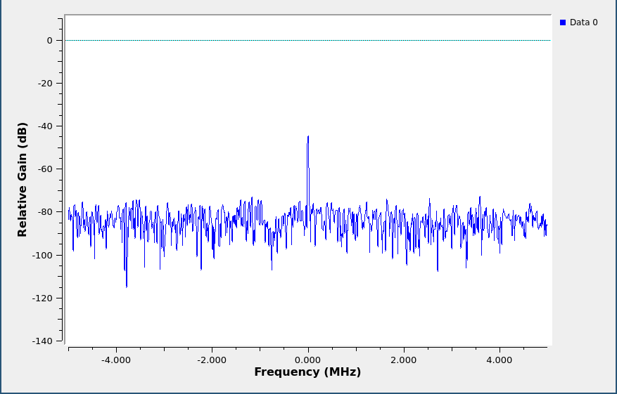
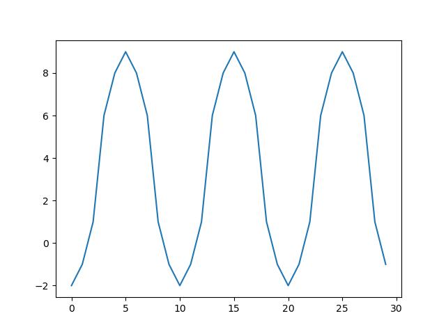
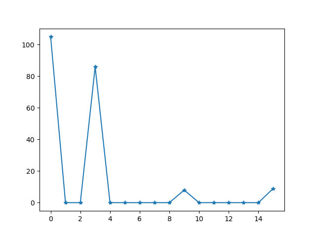

.. _troubleshooting:

================================================
Troubleshooting
================================================

HackRF not detected / "No HackRF boards found."
~~~~~~~~~~~~~~~~~~~~~~~~~~~~~~~~~~~~~~~~~~~~~~~

If the software you're using is unable to detect the HackRF hardware and/or `hackrf_info` returns "No HackRF boards found.", this can be caused by a number of different software or hardware issues.

Solution
--------

    #. If you are using a PortaPack addon, make sure to select "HackRF" mode from the main menu.

    #. If you are using a virtual machine or Windows Subsystem for Linux (WSL), make sure that it is configured to pass through the USB device.

    #. Check whether the device appears in ``lsusb`` (Linux), Device Manager (Windows), or System Report (macOS). If it doesn't not appear, it could either be a firmware issue, an issue with the cable, or another hardware issue.

    #. Try booting the HackRF in DFU mode by holding the "DFU" button when plugging in the device. It should now appear as `NXP Semiconductors LPC4330FET180 [ARM Cortex M4 + M0] (device firmware upgrade mode)` in the locations listed above. If it does appear, then it was likely a firmware issue and you can follow the instructions to :ref:`recover the SPI flash firmware <recovering_firmware>`.

    #. If the device does not appear in DFU mode then it is likely to be an issue with the USB cable. Charge-only cables (which do not include the data lines) have become very common and will cause this symptom. Ideally, test the cable you're using with another device that does some sort of data transfer to be sure that it works, or just try other cables.

    #. If the device still does not appear, it may be a less common issue or possibly a fault with the hardware. See :doc:`Getting Help <getting_help>` for information on where to ask for more support, and please include as much detail as you can about what you've already tried.

.. _bigspike:

There is a big spike in the center of the received spectrum
~~~~~~~~~~~~~~~~~~~~~~~~~~~~~~~~~~~~~~~~~~~~~~~~~~~~~~~~~~~

If you see a large spike in the center of your FFT display regardless of the frequenecy you are tuned to, you are seeing a DC offset (or component or bias). The term "DC" comes from "Direct Current" in electronics. It is the unchanging aspect of a signal as opposed to the "alternating" part of the signal (AC) that changes over time.

   DC spike

Take, for example, the signal represented by the digital sequence:

.. code-block:: sh

	-2, -1, 1, 6, 8, 9, 8, 6, 1, -1, -2, -1, 1, 6, 8, 9, 8, 6, 1, -1, -2, -1, 1, 6, 8, 9, 8, 6, 1, -1

   Example signal

This periodic signal contains a strong sinusoidal component spanning from -2 to 9. If we plot the spectrum of this signal, you can see one spike at the frequency of this sinusoid and a second spike at 0 Hz (DC).

   Spectrum of example signal

If the signal spanned from values -2 to 2 (centered around zero), there would be no DC offset. Since it is centered around 3.5 (the number midway between -2 and 9), there is a DC component.

Samples produced by HackRF are measurements of radio waveforms, but the measurement method is prone to a DC bias introduced by HackRF. It's an artifact of the measurement system, not an indication of a received radio signal. DC offset is not unique to HackRF; it is common to all quadrature sampling systems.

A high DC offset is also one of a few symptoms that can be caused by a software version mismatch. A common problem is that people run an old version of gr-osmosdr with newer firmware.

Solution
--------

There are a few options:

    #. Ignore it. For many applications it isn't a problem. You'll learn to ignore it.

    #. Avoid it. The best way to handle DC offset for most applications is to use offset tuning; instead of tuning to your exact frequency of interest, tune to a nearby frequency so that the entire signal you are interested in is shifted away from 0 Hz but still within the received bandwidth. If your algorithm works best with your signal centered at 0 Hz (many do), you can shift the frequency in the digital domain, moving your signal of interest to 0 Hz and your DC offset away from 0 Hz. HackRF's high maximum sampling rate can be a big help as it allows you to use offset tuning even for relatively wideband signals.

    #. Correct it. There are various ways of removing the DC offset in software. However, these techniques may degrade parts of the signal that are close to 0 Hz. It may look better, but that doesn't necessarily mean that it is better from the standpoint of a demodulator algorithm, for example. Still, correcting the DC offset is often a good choice.
