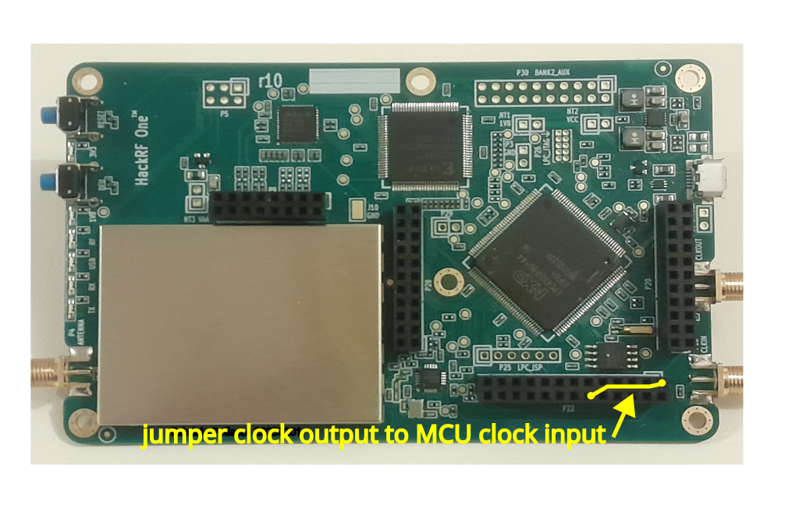

=====
HTime
=====

HTime is a firmware extension for the HackRF One, the open-hardware/open-source
SDR by `Great Scott Gadgets <https://www.greatscottgadgets.com/hackrf/one/>`_.
HTime provides the HackRF SDR with the
capability to perform timed commands and a precise phase synchronization
of internal clocks (sampling, MCU, output) for the best timing performance.
HTime is developed by Fabrizio Pollastri.

Features
~~~~~~~~

    * Unix-like time scale, with a resolution of 5 ns
    * RX/TX sampling synchronized with the time scale
    * Fine time scale/frequency adjust for synchronization with remote reference
      radio signals with a resolution of about 0.25 Hz @ 10 MHz
    * No external hardware required
    * Host time tool for access to time extension API

For now, HTime works only with a 10 MHz sample rate.

Build and Install
~~~~~~~~~~~~~~~~~

HTime is developed into a fork of the original HackRF repository, so all build and
install rules for the original HackRF software apply also to HTime. Please, see
the documentation at `<https://github.com/greatscottgadgets/hackrf>`_

Working Principle
~~~~~~~~~~~~~~~~~

The block diagram below shows the HTime extension implemented in both
the firmware and some spare hardware resources.

The time scale is generated starting from a spare timer (timer 3) of the MCU
that is configured to operate as a ticks counter at 200 MHz, from the MCU clock.

Every second, the ticks counter reaches the max count of 200e6 and generates
an interrupt and restarts counting from zero. A service routine, associated
with this event, increments a software counter counting the seconds.

The ticks counter is also used to generate a trigger signal to
determine a precise time for the start of data sampling. This is obtained
loading into one of the 4 match registers of the timer, a trigger delay in
ticks from the start of the last second. When the counter reaches this value,
an output pin goes to 1 level, while the counter continues counting up the max
count (200e6 ticks). 
The trigger is reset from the ticks counter service routine at the start
of the next second.

The ticks counter is also programmed to generate a pulse on an output pin
every time a max count is reached. This pulse can be used as a 1PPS output
signal for external usage.

Clock generation
++++++++++++++++

As explained above, all signals controlling the sampling timing are
generated from the MCU clock. Since these signals interact with the logic
driven by the sampling clock, it is essential that these clocks have a
constant integer frequency ratio.

For this purpose, the firmware was modified to configure the clock
generator to produce the clocks sampling, MCU, and output from the same
source, to eliminate possible phase shifts and frequency drifts among them.

This is truly possible with HackRF board revisions different from R9 that
have the si5351c multisynthesizer with 8 clock sections, implementing a
little creative routing of the clocks on the board.
Revision board R9 has the si5351a multisynthesizer
with 3 clock sections only. In this case, two clock sections are used:
section 1 for the sampling clock and section 2 for the MCU and output clocks.

The clock generation for the tuner and the mixer is left unchanged.

HackRF board revisions not R9
~~~~~~~~~~~~~~~~~~~~~~~~~~~~~

HackRF board versions with the SI5351C multisynthesizer with 8 clock sections.

Clock routing
+++++++++++++

A first choice was to configure the MCU to change its clock source from
the ordinary 12 MHz XTAL to the MCU input pin GP_CLKIN.

Unfortunately, not r9 boards connect to the GP_CLKIN
input to the output section 7 of the
SI5351C. The PLL divisor of this section is limited to a small range of
even integer values (6-254), so it is not suitable for a fine frequency
control-like sections 0-5 offering a fractional divisor with 20 bits
resolution.

Fortunately, the MCU allows the input external clock (GP_CLKIN) to be mapped
alternatively on pin 120 (PF_4), that is connected to connector P22 pin 12
(signal i2s0_rx_sck). So, it is possible to connect a jumper from this
to connector p22 pin1 (signal clkout) and use the clkout clock as input
clock for the MCU.

  Output clock jumper for not R9 board revisions

The SI5351C allows to configure the block of sections 0-3 to be all driven
by the PLL frequency of section 0. So, the phase and frequencies
generated by sections 0-3 are coherent and cannot drift. Since sections
0, 1, and 2 generate the clocks needed for data sampling, in this way also
the MCU clock becomes coherent with the sampling clock, and the requirement
of the previous section is met.

Since clkout comes from section 3 of the si5351c, and this section can be
configured to take as input clock the output of section 0 a full resolution
divisor (20 bits), suitable for the clock
fequency adjustments required by GSCV frequency control.

Trigger routing
+++++++++++++++

The trigger is generated by the match register 0 of the ticks counter.
This event is configured to change the level of the MCU output P2_3, pin 87
(signal i2c1_sda) that is connected to connector p22, pin 6.
The HackRF board already has a trigger input on connector p28, pin 16.
When this input goes to 1 level, it enables the data sampling.
So, the generated trigger can be easily routed with a wire jumper
to the sampling trigger input, to do the job.

  Sampling trigger jumper for all board revisions

HackRF board revision R9
~~~~~~~~~~~~~~~~~~~~~~~~

HackRF board version with SI5351A multisynthesizer with 3 clock sections.

Clock routing
+++++++++++++

Also for revision R9, the choice was to configure the MCU to change its clock
source from the ordinary 12 MHz XTAL to the MCU input pin GP_CLKIN.

In this board version, GP_CLKIN is already connected to the clkout from section 2
of the multisynthesizer. No jumpers are needed. While the multisynthesizer secion 1
generates the sampling clocks. These frequencies are adjusted by software 
updating the parameters in multisynthesizer sections 1 and 2. Since this
updates cannot be simultaneous, a small phase shift is added at each change.
To minimize this effect, the change order is reversed after each change.

The clock generation for the tuner and the mixer from the multisynthesizer section 0
is left unchanged.

Trigger routing
+++++++++++++++

The trigger routing is the same as the other HackRF board revisions.

HTime USB API
~~~~~~~~~~~~~

This API allows access all the firmware features of HTime. An example of
application can be seen in the :doc:`source <htime_tool_source>` of the
:doc:`HTime Tool <htime_tool>`.

.. rst-class:: apientry

  hackrf_time_set_divisor_next_pps(device, divisor)

Set **divisor** value (uint32_t) into the ticks counter at the next PPS. With the
HackRF MCU working @ 200 MHz, the ticks counter must be set to 200000000-1 to obtain a
counting period of 1 second. **device** is a pointer to the HackRF device.

.. rst-class:: apientry

  hackrf_time_set_divisor_one_pps(device, divisor)

Set **divisor** value (uint32_t) into the ticks counter from the next PPS for only one
counter cycle then restore the previous divisor value. **device** is a pointer
to the HackRF device.

.. rst-class:: apientry

  hackrf_time_set_trig_delay_next_pps(device, trig_delay)

Set **trig_delay** value (uint32_t) as the sampling trigger delay at next PPS.
The trigger delay is from the start of the second (PPS leading edge) in tick units.
**device** is a pointer to the HackRF device.

 
.. rst-class:: apientry

  hackrf_time_get_seconds_now(device, &seconds)

Get the value of the second counter immediately into **seconds** (* int64_t).
**device** is a pointer to the HackRF device.

  
.. rst-class:: apientry

  hackrf_time_set_seconds_now(device, seconds)

Set the **seconds** value (int64_t) immediately into the second counter.
**device** is a pointer to the HackRF device.

.. rst-class:: apientry

  hackrf_time_set_seconds_next_pps(device, seconds)

Set the **seconds** value (int64_t) at next PPS into the second counter.
**device** is a pointer to the HackRF device.

  
.. rst-class:: apientry

  hackrf_time_get_ticks_now(device, &ticks)

Get the value of the tick counter immediately into **ticks** (* uint32_t).
**device** is a pointer to the HackRF device.

  
.. rst-class:: apientry

  hackrf_time_set_ticks_now(device, ticks)

Set the **ticks** value (uint32_t) immediately into the tick counter.
**device** is a pointer to the HackRF device.

  
.. rst-class:: apientry

  hackrf_time_set_clk_freq(device, clk_freq)

Set the **clk_freq** value (double) as the sampling rate synchronized to the MCU
clock. Must be a value near (+-100 Hz) 10 MHz.
**device** is a pointer to the HackRF device.

  
.. rst-class:: apientry

  hackrf_time_set_mcu_clk_sync(device, enable)

Set the **enable** value (uint8_t) of the MCU synchronized clock mode.
When this mode is on, all relevant clocks are kept in sync to avoid phase shifts
and frequency drifts.
**device** is a pointer to the HackRF device.

.. raw:: html

 
HTime documentation by Fabrizio Pollastri is licensed under <a href="https://creativecommons.org/licenses/by-sa/4.0/?ref=chooser-v1" target="_blank" rel="license noopener noreferrer" style="display:inline-block;">CC BY-SA 4.0</a>

